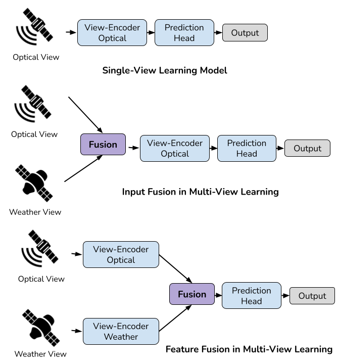

# Multi-view learning (mvlearning)
Framework for different fusion strategies in multi-view learning with PyTorch. _Academic purposes_



## Examples
* [Example on how to define and use different fusion strategies in the MVL model](./examples/different_fusion_strategies.ipynb)
* [Example on how to train these MVL models](./examples/train_examples.ipynb)

For definitions on the concepts used here please look at [Common Practices and Taxonomy in Deep Multiview Fusion for Remote Sensing Applications](https://ieeexplore.ieee.org/document/10418966).


## Use
* For Input fusion (with feature concatenation) you can just create it with
```python
from mvlearning.fusion import InputFusion
InputFusion(single_pytorch_model, view_names=["a list of string", "with the names of the views"])
```
* For Decision fusion (with averaging output) you can just create it with
```python
from mvlearning.fusion import DecisionFusion
DecisionFusion({"view 1": pytorch_model1, "view 2": pytorch_model2, ...})
```
* For Feature fusion you can just create it with
```python
from mvlearning.fusion import FeatureFusion
FeatureFusion({"view 1": pytorch_encoder1, "view 2": pytorch_encoder2, ...}, pytorch_module_fusing, pytorch_model_head)
```


## Install

* For installation you can run:
```
pip install --editable .
```